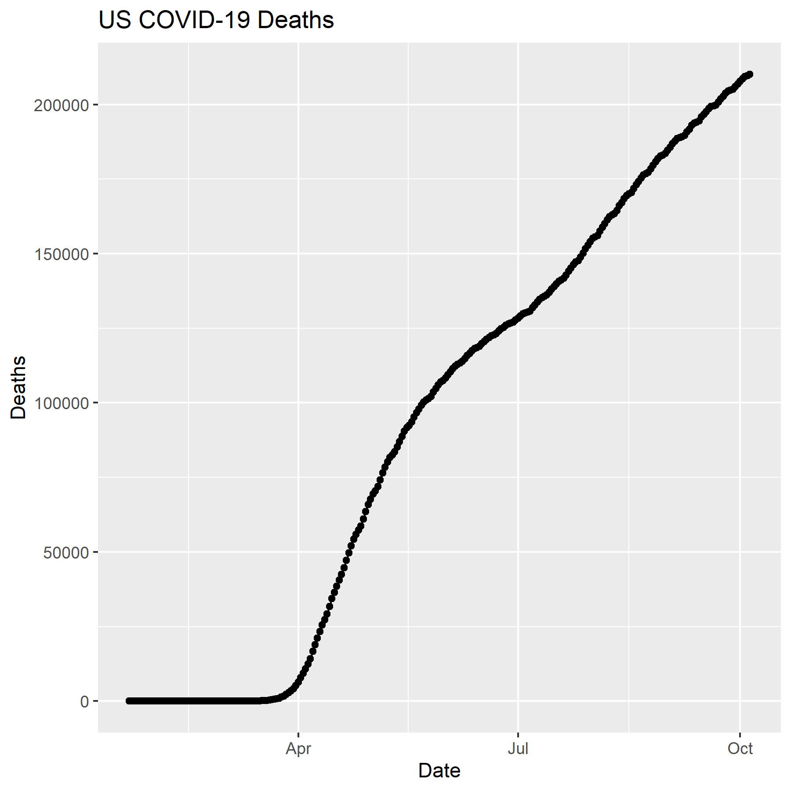

```{r setup, include=FALSE}
knitr::opts_chunk$set(echo = TRUE)
```


```{r}
library("tidyverse")
library(lubridate)
```
```{r}
time_series_confirmed_long <- read_csv(url("https://raw.githubusercontent.com/CSSEGISandData/COVID-19/master/csse_covid_19_data/csse_covid_19_time_series/time_series_covid19_confirmed_global.csv")) %>%
  rename(Province_State = "Province/State", Country_Region = "Country/Region")  %>% 
               pivot_longer(-c(Province_State, Country_Region, Lat, Long),
                             names_to = "Date", values_to = "Confirmed") 
# Let's get the times series data for deaths
time_series_deaths_long <- read_csv(url("https://raw.githubusercontent.com/CSSEGISandData/COVID-19/master/csse_covid_19_data/csse_covid_19_time_series/time_series_covid19_deaths_global.csv")) %>%
  rename(Province_State = "Province/State", Country_Region = "Country/Region")  %>% 
  pivot_longer(-c(Province_State, Country_Region, Lat, Long),
               names_to = "Date", values_to = "Deaths")
# Create Keys 
time_series_confirmed_long <- time_series_confirmed_long %>% 
  unite(Key, Province_State, Country_Region, Date, sep = ".", remove = FALSE)
time_series_deaths_long <- time_series_deaths_long %>% 
  unite(Key, Province_State, Country_Region, Date, sep = ".") %>% 
  select(Key, Deaths)
# Join tables
time_series_long_joined <- full_join(time_series_confirmed_long,
    time_series_deaths_long, by = c("Key")) %>% 
    select(-Key)
# Reformat the data
time_series_long_joined$Date <- mdy(time_series_long_joined$Date)
# Create Report table with counts
time_series_long_joined_counts <- time_series_long_joined %>% 
  pivot_longer(-c(Province_State, Country_Region, Lat, Long, Date),
               names_to = "Report_Type", values_to = "Counts")
```

```{r}
pdf("images/time_series_example_plot.pdf", width=6, height=3)
time_series_long_joined %>% 
  group_by(Country_Region,Date) %>% 
  summarise_at(c("Confirmed", "Deaths"), sum) %>% 
  filter (Country_Region == "US") %>% 
    ggplot(aes(x = Date,  y = Deaths)) + 
    geom_point() +
    geom_line() +
    ggtitle("US COVID-19 Deaths")
dev.off()
```

```{r}
ppi <- 300
png("images/time_series_example_plot.png", width=6*ppi, height=6*ppi, res=ppi)
time_series_long_joined %>% 
  group_by(Country_Region,Date) %>% 
  summarise_at(c("Confirmed", "Deaths"), sum) %>% 
  filter (Country_Region == "US") %>% 
    ggplot(aes(x = Date,  y = Deaths)) + 
    geom_point() +
    geom_line() +
    ggtitle("US COVID-19 Deaths")
dev.off()
```

 


```{r}
library(plotly)
ggplotly(
  time_series_long_joined %>% 
    group_by(Country_Region,Date) %>% 
    summarise_at(c("Confirmed", "Deaths"), sum) %>% 
    filter (Country_Region == "US") %>% 
    ggplot(aes(x = Date,  y = Deaths)) + 
      geom_point() +
      geom_line() +
      ggtitle("US COVID-19 Deaths")
 )
```

```{r}
library(plotly)
US_deaths <- time_series_long_joined %>% 
    group_by(Country_Region,Date) %>% 
    summarise_at(c("Confirmed", "Deaths"), sum) %>% 
    filter (Country_Region == "US")
 p <- ggplot(data = US_deaths, aes(x = Date,  y = Deaths)) + 
        geom_point() +
        geom_line() +
        ggtitle("US COVID-19 Deaths")
ggplotly(p)
```

```{r}
library(gganimate)
library(transformr)
theme_set(theme_bw())
```

```{r}
data_time <- time_series_long_joined %>% 
    group_by(Country_Region,Date) %>% 
    summarise_at(c("Confirmed", "Deaths"), sum) %>% 
    filter (Country_Region %in% c("China","Korea, South","Japan","Italy","US")) 
p <- ggplot(data_time, aes(x = Date,  y = Confirmed, color = Country_Region)) + 
      geom_point() +
      geom_line() +
      ggtitle("Confirmed COVID-19 Cases") +
      geom_point(aes(group = seq_along(Date))) +
      transition_reveal(Date) 
# Some people needed to use this line instead
# animate(p,renderer = gifski_renderer(), end_pause = 15)
animate(p, end_pause = 15)
```

# Challenge 1
```{r}
ppi <- 300
png("images/time_series_challenge_plot.png", width=3*ppi, height=3*ppi, res=ppi)
data_time <- time_series_long_joined %>% 
    group_by(Country_Region,Date) %>% 
    summarise_at(c("Confirmed", "Deaths"), sum) %>% 
    filter (Country_Region == "China") %>%
ggplot(aes(x = Date,  y = Confirmed)) + 
      geom_point() +
      geom_line() +
      ggtitle("Confirmed in China") +
      geom_point ()
```

 


# Challenge 2
    ```{r}
data_time <- time_series_long_joined %>% 
    group_by(Country_Region,Date) %>% 
    summarise_at(c("Confirmed", "Deaths"), sum) %>% 
    filter (Country_Region %in% c("United Kingdom","France","Italy","Brazil", "India","Peru", "Spain", "Iran", "Mexico", "US")) 
p <- ggplot(data_time, aes(x = Date,  y = Confirmed, color = Country_Region)) + 
      geom_point() +
      geom_line() +
      ggtitle("Highest Death Totals") +
      geom_point(aes(group = seq_along(Date))) +
      transition_reveal(Date) 
# Some people needed to use this line instead
# animate(p,renderer = gifski_renderer(), end_pause = 15)
animate(p, end_pause = 15)
```

# Challenge 3
```{r}
data_time <- time_series_long_joined %>% 
    group_by(Province_State,Date) %>% 
    summarise_at(c("Confirmed", "Deaths"), sum) %>% 
    filter (Province_State %in% c("Massachusetts","New York","Rhode Island","Vermont", "Conneticut","Maine", "New Hampshire")) 
p <- ggplot(data_time, aes(x = Date,  y = Confirmed, color = Country_Region)) + 
      geom_point() +
      geom_line() +
      ggtitle("Confirmed North East COVID-19 Cases") +
      geom_point(aes(group = seq_along(Date))) +
      transition_reveal(Date) 
animate(p, end_pause = 15)
```

